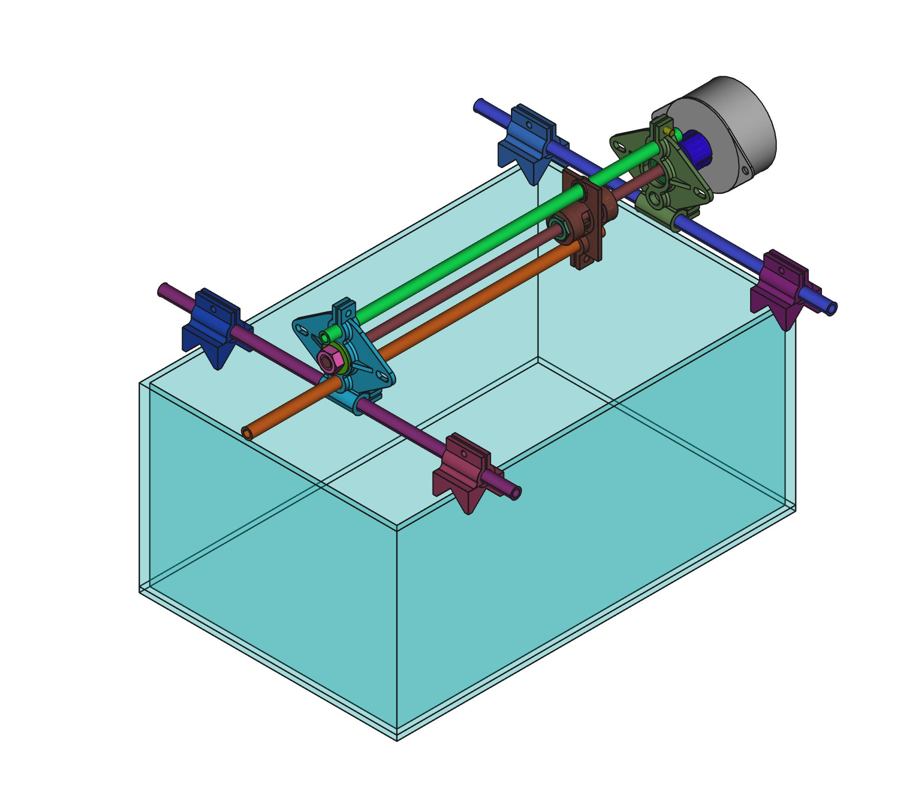

---

[

](http://www.echopen.org)

---

# echʘlab Axis

This project is a linear axis mechanism for moving targets or transducers to make various measurements.

Find source files here : https://github.com/echopen-foundation/echolab_axis

Find documentation here : https://github.com/echopen-foundation/echolab_axis/wiki

---
